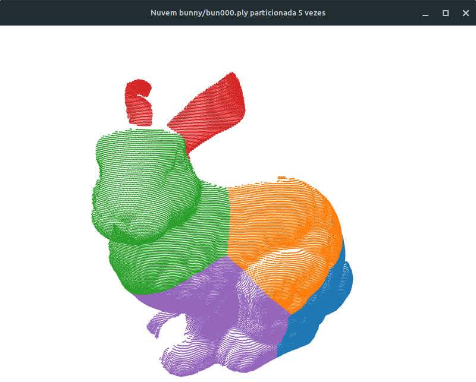

# pointy

Pequena abstração que encapsula algumas classes da biblioteca Open3D para experimentação rápida com nuvens de pontos usando Python. A implementação completa está contida num único arquivo: `pointy.py`.

## Dependências

As bibliotecas necessárias estão listadas no arquivo `requirements.txt`. Para instala-las com um comando apenas, execute:

```
pip3 install --upgrade -r requirements.txt
```

Dependendo do seu sistema operacional, o comando `pip3` pode estar indisponível em lugar de apenas `pip`.

## Arquitetura

- `PointCloud`: abstrai uma nuvem de pontos, encapsulando o objeto padrão do Open3D e adicionando outras funcionalidades, especialmente a funcionalidade de clusterização na forma do método `.kmeans()`.
- `Registration`: encapsula a execução de um algoritmo de registro, hoje apenas o ICP ponto-a-ponto, mas pode-se expandir depois. Entrega método que facilitam a experimentação, como `.show_result()`. Armazena nativamente os resultados do registro, como a matriz de transformação, o RMSE e a nuvem já alinhada.

## Exemplos

- `demo_draw.py`: carrega uma nuvem de pontos lida via linha de comando e a exibe numa janela de visualização iterativa.
- `demo_icp.py`: carrega duas nuvens de pontos lidas via linha de comando, executa o ICP e exibe resultado, tanto visual (janela com alvo e alinhada) quanto no terminal (matriz de transformação e RMSE).
- `demo_kmeans.py`: carrega uma nuvem de pontos lida via linha de comando e um número de partições, então executa o k-Médias de acordo e mostra nuvem particionada.

## Nuvens de teste

Este repositório também traz um conjunto de pastas com nuvens de exemplo amplamente usadas na literatura, como o coelho e o buddha da Stanford e o martelo.  que até hoje eu não sei de onde veio.



## Licença

Este repositório (seu código-fonte e quaisquer outros elementos que o constitui) é provido "tal como ele é", sem nenhuma garantia explícita ou implícita. De maneira alguma os autores serão responsáveis por quaisquers danos oriundos do uso deste repositório.

É garantida a permissão a qualquer pessoa para uso irrestrito deste repositório, incluindo aplicações comerciais, além de permissão para alterar o seu conteúdo e redistribuí-lo livremente mediante as seguintes restrições:

1. A origem deste repositório não deve ser deturpada; você é proibido de reinvindicar a autoria original deste repositório. Se você usar o conteúdo deste repositório em um produto comercializável, um reconhecimento formal na documentação do produto seria apreciado, mas não é necessário.

2. Versões distintas do conteúdo deste repositório, em especial de código-fonte, devem ser marcadas explicitamente como tais, e não devem ser apontadas como sendo as originais.

3. Esta licença não deve ser removida ou alterada em nenhuma redistribuição deste repositório.

